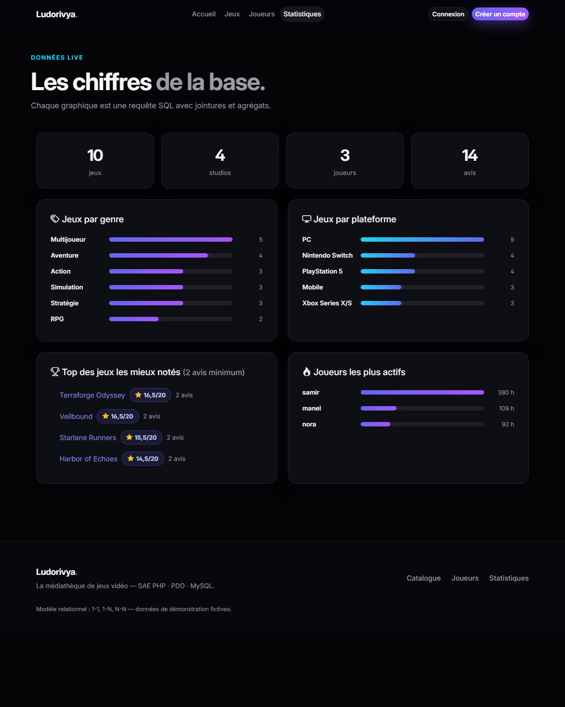
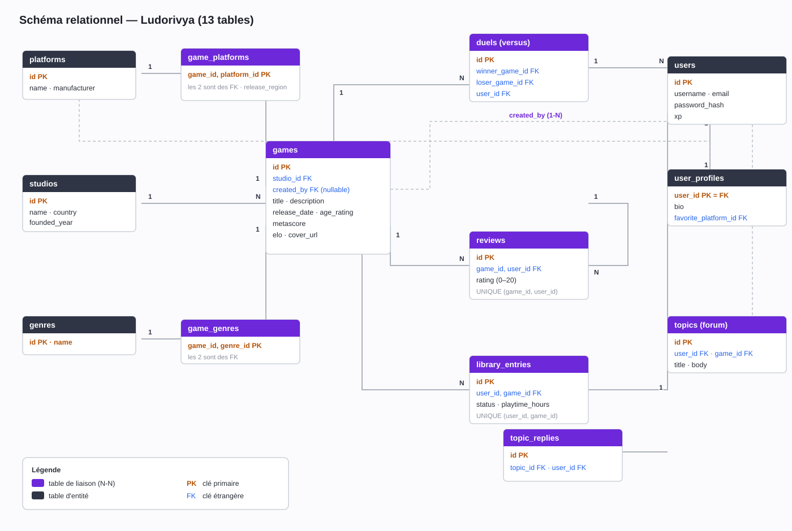

# Ludorivya


**Ludorivya** est une médiathèque de jeux vidéo : une application web dynamique en **PHP 8**, **PDO** et **MySQL/MariaDB**. Tout le monde peut explorer le catalogue ; les joueurs inscrits notent leurs jeux, construisent leur bibliothèque personnelle (statut, temps de jeu) et enrichissent eux-mêmes le catalogue.

- **Dépôt** : <https://github.com/neorxprod/ludorivya>
- **Auteur** : neorxprod
- Projet réalisé dans le cadre d'une SAE (application web + base de données relationnelle).

## Aperçu

| Accueil | Catalogue |
| --- | --- |
|  |  |

| Fiche jeu | Statistiques |
| --- | --- |
|  |  |

## Fonctionnalités

**Pour tous les visiteurs :**

- catalogue avec recherche (titre, description, studio), filtres par **genre** et **plateforme**, tri et **pagination** ;
- fiche détaillée de chaque jeu : studio, plateformes (avec région de sortie), genres, avis des joueurs ;
- profils publics des joueurs et activité des bibliothèques (sans données privées) ;
- statistiques en direct : répartitions par genre/plateforme, top 5 des jeux, joueurs les plus actifs.

**Pour les joueurs connectés :**

- inscription / connexion sécurisées (mot de passe haché, anti force brute) ;
- publier, modifier et supprimer **son** avis (un seul par jeu) ;
- bibliothèque personnelle : ajouter un jeu, changer son statut (souhaité / en cours / terminé / abandonné), suivre ses heures de jeu, retirer un jeu ;
- **ajouter un jeu au catalogue**, puis modifier ou supprimer **ses propres** fiches ;
- modifier son profil public (bio, plateforme préférée).

## Technologies

| Partie | Technologie |
| --- | --- |
| Interface | HTML, CSS, Bootstrap 5 (chargé en local) + design system personnalisé |
| Interactions | JavaScript vanilla : validation des formulaires, animations au scroll, compteurs |
| Serveur | PHP 8.x |
| Base de données | MySQL / MariaDB |
| Accès BDD | PDO (requêtes préparées natives, transactions) |
| Versionnage | Git + GitHub |

Le site fonctionne **sans connexion internet** : Bootstrap, les icônes, la police Inter et les jaquettes de démonstration sont stockés en local dans `public/assets/`.

## Relations SQL demandées

Le sujet demande au minimum une relation 1-1, une relation 1-N et une relation N-N — toutes sont **réellement utilisées par l'application** (lecture ET écriture) :

| Type | Tables | Utilisation dans le site |
| --- | --- | --- |
| **1-1** | `users` / `user_profiles` (PK partagée) | création à l'inscription, modification depuis « Mon profil » |
| **1-N** | `studios` → `games` | affichée sur chaque fiche, choisie à l'ajout d'un jeu |
| **N-N** | `games` ↔ `platforms` via `game_platforms` (PK composite) | filtres du catalogue, fiches, statistiques |

Le schéma va plus loin :

- `games` ↔ `genres` (2e N-N, sert au filtre par genre) ;
- `users` ↔ `games` via `library_entries` (N-N **porteuse d'attributs** : statut, heures) ;
- `users` ↔ `games` via `reviews` (un avis par joueur et par jeu, garanti par `UNIQUE`) ;
- `users` → `games` via `created_by` (autorisations : seul l'auteur d'une fiche peut la modifier/supprimer).



Détails table par table : [docs/SCHEMA_RELATIONNEL.md](docs/SCHEMA_RELATIONNEL.md)

## Installation avec XAMPP

1. **Démarrer** Apache et MySQL dans le panneau XAMPP.

2. **Importer la base** (au choix) :

   - *Avec phpMyAdmin* : ouvrir `http://localhost/phpmyadmin` → onglet **Importer** → choisir `database/schema.sql` → Exécuter.
   - *En ligne de commande* (depuis le dossier du projet) :

   ```bat
   C:\xampp\mysql\bin\mysql.exe -u root --default-character-set=utf8mb4 < database\schema.sql
   ```

3. **Relier le projet à Apache** (lien symbolique, à lancer dans un terminal administrateur) :

   ```bat
   mklink /J C:\xampp\htdocs\ludorivya "C:\chemin\vers\LUDORIVYA"
   ```

   (ou copier simplement le dossier du projet dans `C:\xampp\htdocs\`).

4. **Ouvrir le site** : <http://localhost/ludorivya/public/>

5. *(Facultatif)* Si tes identifiants MySQL ne sont pas ceux par défaut de XAMPP (`root` sans mot de passe), copie `config/database.example.php` vers `config/database.php` et adapte-le. Ce fichier est ignoré par Git.

### Compte de démonstration

```text
Email : nora@example.test
Mot de passe : Ludorivya2026!
```

(deux autres comptes existent : samir / SamirJoue2026! et manel / ManelTeste2026!)

## Structure du projet

```text
LUDORIVYA/
  .github/workflows/php.yml   <- CI : vérification de syntaxe PHP à chaque push
  config/
    database.example.php      <- modèle de configuration (le vrai est gitignoré)
  database/
    schema.sql                <- création de la base + données de démonstration
  docs/
    SCHEMA_RELATIONNEL.md     <- le schéma expliqué table par table
    BONUS_NOSQL.md            <- bonus : limites du relationnel + MongoDB
    PLAN_ACTION.md
    images/                   <- captures, bannière, diagramme
  public/                     <- racine web
    index.php                 <- accueil
    games.php                 <- catalogue (recherche, filtres, tri, pagination)
    game.php                  <- fiche d'un jeu + avis + bibliothèque
    create.php / edit.php     <- formulaires d'ajout / modification d'un jeu
    game_store.php / game_update.php / game_delete.php
    review_store.php / review_delete.php
    library_store.php / library_delete.php
    login.php / login_store.php / logout.php
    register.php / register_store.php
    profile.php / profile_update.php
    users.php / stats.php
    assets/                   <- CSS, JS, police, jaquettes, Bootstrap local
  src/
    bootstrap.php             <- session, CSRF, connexion PDO
    Database.php              <- connexion PDO centralisée
    functions.php             <- helpers (validation, sécurité, rendu)
```

Convention : chaque formulaire a sa page d'affichage (`page.php`) et son traitement POST séparé (`*_store.php`, `*_update.php`, `*_delete.php`).

## Sécurité appliquée

- **Requêtes préparées PDO partout** (`ATTR_EMULATE_PREPARES = false`) — aucune concaténation de données utilisateur dans le SQL.
- **Jeton CSRF** vérifié (`hash_equals`) sur tous les formulaires POST, y compris la déconnexion.
- Mots de passe : `password_hash()` / `password_verify()`, jamais stockés en clair, **anti force brute** (pause après 5 échecs).
- Sessions durcies : cookie `HttpOnly` + `SameSite=Lax`, `session_regenerate_id()` après connexion et inscription.
- Échappement HTML systématique avec `e()` (`htmlspecialchars`).
- **Validation côté serveur** de toutes les entrées (types, bornes, longueurs, dates réelles, URLs, ids existants en base), même quand JavaScript valide déjà côté client.
- Autorisations vérifiées côté serveur : on ne modifie que **ses** avis, **sa** bibliothèque, **ses** fiches de jeux.
- Redirections restreintes aux pages internes (anti open redirect).
- Erreurs techniques journalisées (`error_log`), jamais affichées aux visiteurs.

## Vérification automatique

`.github/workflows/php.yml` vérifie la syntaxe de tous les fichiers PHP à chaque push sur GitHub.

## Bonus NoSQL

[docs/BONUS_NOSQL.md](docs/BONUS_NOSQL.md) décrit un scénario de montée en charge (millions de jeux, milliards d'avis), identifie les requêtes du projet qui deviendraient coûteuses, et propose une alternative conceptuelle avec MongoDB (documents dénormalisés pour la recherche et les statistiques), sans implémentation.

## État du projet

- [x] Base relationnelle (1-1, 1-N, 2× N-N, 2× N-N porteuses).
- [x] CRUD complet : jeux, avis, bibliothèque, profil.
- [x] Recherche, filtres par genre et plateforme, tri, pagination.
- [x] Authentification sécurisée + CSRF sur tous les formulaires.
- [x] Interface Bootstrap 5 + design system, fonctionne hors ligne.
- [x] JavaScript : validation, animations au scroll, compteurs.
- [x] Documentation (README, schéma, bonus NoSQL).
- [x] CI de vérification syntaxique.
