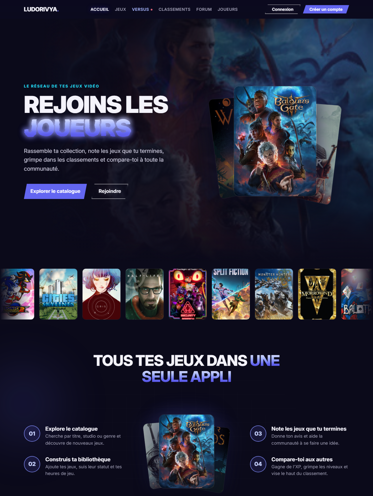
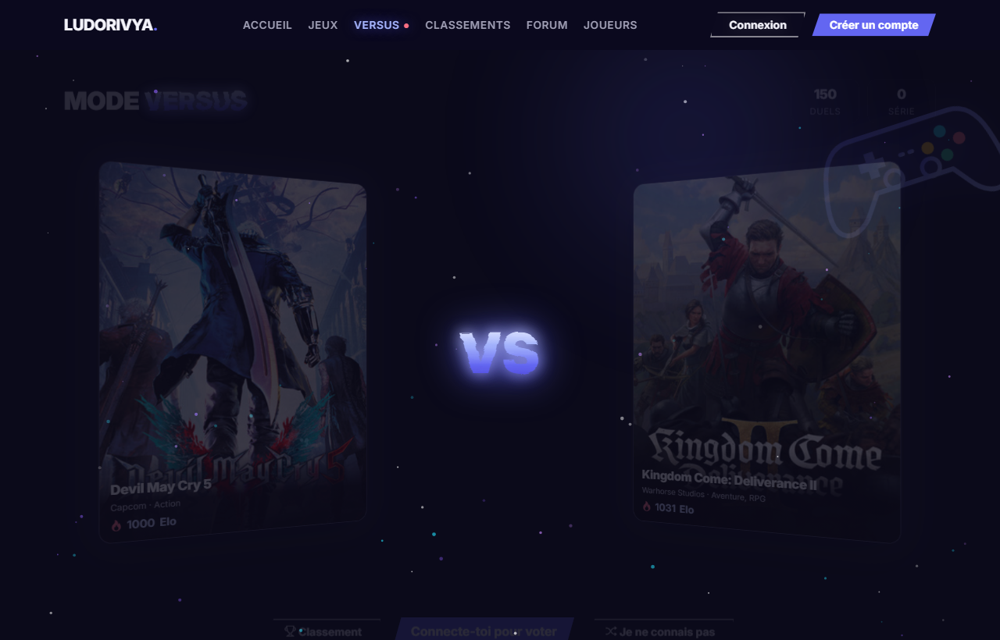
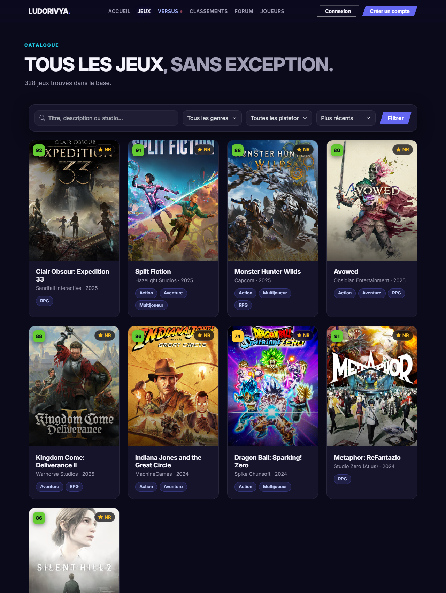
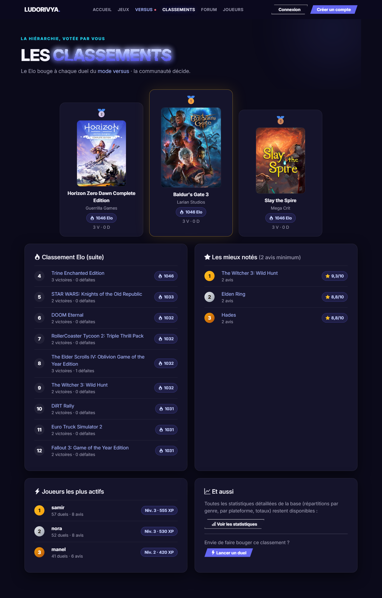
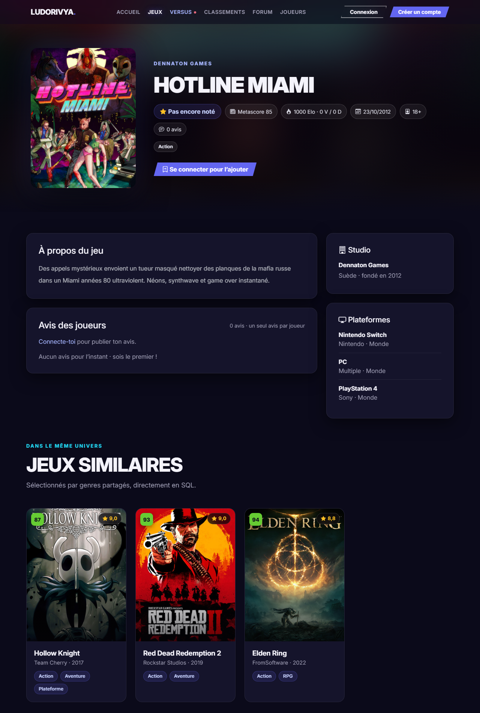
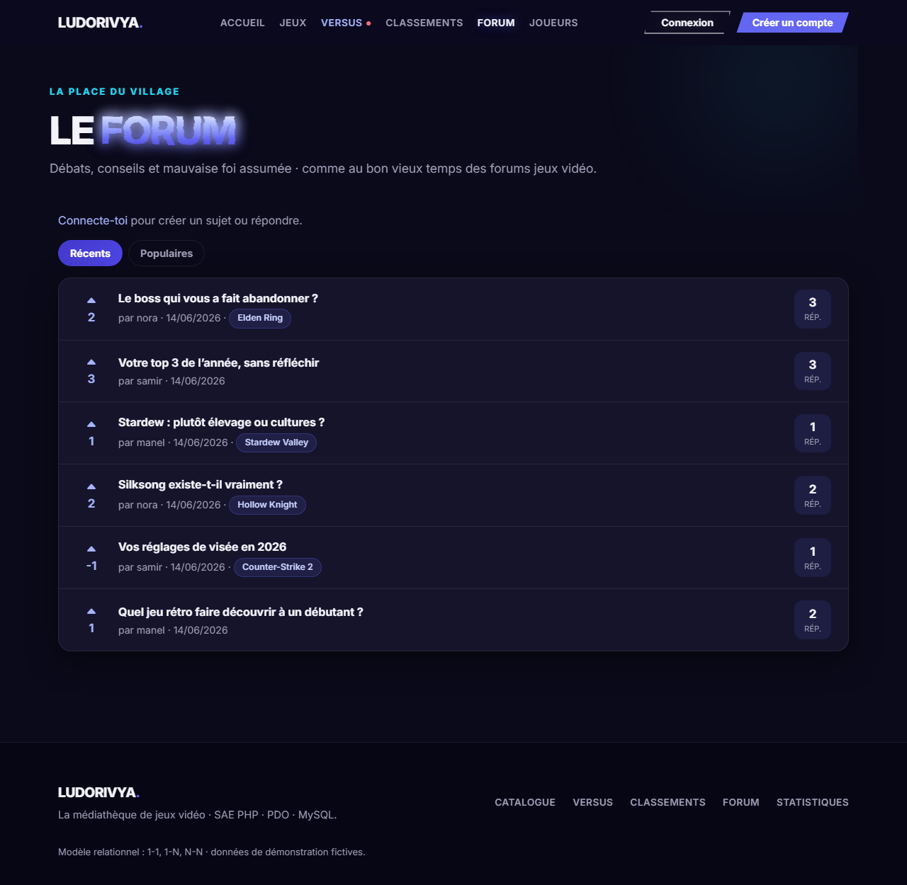
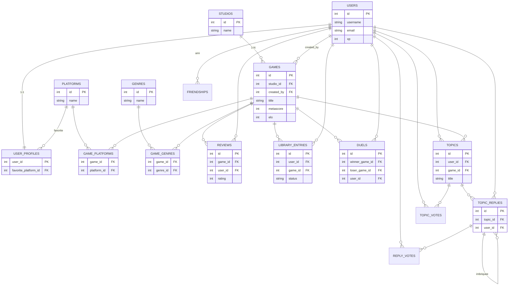

<div align="center">


# Ludorivya

**Le réseau social de tes jeux vidéo · catalogue, versus, classements et forum.**


</div>

**Ludorivya** est une application web dynamique en **PHP 8**, **PDO** et **MySQL/MariaDB**. Explore un catalogue de **328 vrais jeux** (des classiques des années 90 aux sorties récentes), note-les **en un clic avec des étoiles**, construis ta bibliothèque, débats sur le **forum**… et surtout, affronte la communauté dans le **mode Versus** : deux jeux face à face, ton vote fait évoluer leur classement Elo en direct.

- 🔗 **Dépôt** : <https://github.com/neorxprod/ludorivya>
- 👤 **Auteur** : neorxprod
- 🎓 Projet réalisé dans le cadre d'une **SAE** (application web + base de données relationnelle).
- 📘 Documentation : [guide complet du projet](docs/RAPPORT.md) · [schéma de la base](docs/SCHEMA_RELATIONNEL.md) · [bonus NoSQL](docs/BONUS_NOSQL.md)

---

## 🚀 Installation et test en 5 minutes

> Suis ces étapes dans l'ordre. À la fin, le site tourne sur ta machine et tu peux te connecter.

### Prérequis : installer XAMPP (une seule fois)

XAMPP fournit les 3 outils dont le site a besoin : **Apache** (le serveur web), **MySQL** (la base de données) et **PHP 8**.

1. Télécharge XAMPP : <https://www.apachefriends.org/fr/index.html>
2. Installe-le (laisse les options par défaut). Sous Windows il s'installe dans `C:\xampp`.

### Étape 1 · Récupérer le projet

Télécharge le projet et place le dossier où tu veux, par exemple dans `Documents`.

```bat
git clone https://github.com/neorxprod/ludorivya.git
```

> Pas de Git ? Sur la page GitHub : bouton vert **Code → Download ZIP**, puis décompresse-le.

### Étape 2 · Démarrer les serveurs

Ouvre le **XAMPP Control Panel** et clique sur **Start** en face de **Apache** puis de **MySQL**. Les deux doivent devenir **verts**. ✅

> ⚠️ Si MySQL ne démarre pas, c'est souvent qu'un autre programme occupe son port · ferme Skype ou un autre serveur MySQL et réessaie.

### Étape 3 · Créer la base de données

Le fichier `database/schema.sql` **crée tout seul** la base `ludorivya`, ses 16 tables et les 328 jeux. Tu n'as rien à créer à la main.

**Méthode simple (avec phpMyAdmin) :**

1. Ouvre <http://localhost/phpmyadmin>
2. Onglet **Importer** (en haut)
3. **Choisir un fichier** → sélectionne `database/schema.sql` dans le dossier du projet
4. Tout en bas, clique **Importer / Exécuter**
5. Un bandeau vert confirme : la base `ludorivya` apparaît dans la liste à gauche.

**Méthode ligne de commande** (équivalente) · ouvre un terminal **dans le dossier du projet** :

```bat
C:\xampp\mysql\bin\mysql.exe -u root --default-character-set=utf8mb4 < database\schema.sql
```

### Étape 4 · Rendre le site accessible par Apache

Apache ne sert que les fichiers placés dans `C:\xampp\htdocs`. **Le plus simple : copie le dossier du projet dans `htdocs`** et renomme-le `ludorivya`. Tu dois obtenir : `C:\xampp\htdocs\ludorivya\public\index.php`.

> *Alternative pour ne pas copier (optionnel)* : créer un raccourci. Ouvre un terminal **en administrateur** et tape :
> ```bat
> mklink /J C:\xampp\htdocs\ludorivya "C:\chemin\complet\vers\LUDORIVYA"
> ```

### Étape 5 · Ouvrir le site 🎉

Dans ton navigateur :

```text
http://localhost/ludorivya/public/
```

### Étape 6 · Tester que tout marche

1. La page d'accueil s'affiche avec des jaquettes de jeux → **Apache + MySQL fonctionnent**.
2. Clique **Connexion** et entre le compte de démo :
   ```text
   Email : nora@example.test
   Mot de passe : Ludorivya2026!
   ```
3. Va sur **Versus** dans le menu, clique sur un jeu : le score Elo bouge → **les écritures en base fonctionnent**.
4. Va sur **Forum**, ouvre un sujet, réponds → tout est opérationnel. ✅

### 🛠️ En cas de problème

| Symptôme | Cause et solution |
| --- | --- |
| Page **« Base de données non connectée »** | MySQL n'est pas démarré (étape 2) **ou** le schéma n'a pas été importé (étape 3). |
| Erreur / page blanche | Apache n'est pas démarré, ou le dossier n'est pas dans `htdocs` (étape 4). |
| **`localhost:8123` ne marche pas** | C'est une adresse de **test temporaire**. L'adresse réelle est **`http://localhost/ludorivya/public/`** (via Apache). |
| Identifiants MySQL personnalisés | Copie `config/database.example.php` en `config/database.php` et mets-y tes identifiants (ce fichier est ignoré par Git). |

---

## Sommaire

- [Aperçu](#aperçu)
- [Fonctionnalités](#fonctionnalités)
- [Technologies](#technologies)
- [Relations SQL demandées](#relations-sql-demandées)
- [Comment le catalogue a été construit](#comment-le-catalogue-a-été-construit-le-pipeline)
- [Structure du projet](#structure-du-projet)
- [Sécurité appliquée](#sécurité-appliquée)
- [Bonus NoSQL](#bonus-nosql) · [État du projet](#état-du-projet)

## Aperçu

| Accueil | Mode Versus |
| :---: | :---: |
|  |  |
| **L'accueil** : héros animé, sélection à la une, chiffres en direct. | **Le versus** : deux jeux, un vote, l'Elo bouge en temps réel. |

| Catalogue | Classements |
| :---: | :---: |
|  |  |
| **328 jeux** avec recherche, filtres, tri et pagination. | **Podium Elo**, meilleures notes et joueurs les plus actifs. |

| Fiche jeu | Forum |
| :---: | :---: |
|  |  |
| **Fiche détaillée** : avis aux étoiles, bilan de duels, jeux similaires. | **Forum** façon jeuxvideo.com : sujets liés aux jeux et réponses. |

## Fonctionnalités

**Le mode Versus (le cœur du concept) :**

- deux jeux tirés au sort s'affrontent, tu votes pour ton préféré ;
- le **score Elo** des deux jeux est recalculé par le serveur dans une transaction (formule Elo, K = 32) ;
- chaque vote rapporte **5 XP**, enchaîne les duels et fais grimper ta série ;
- bouton **« Je ne connais pas »** pour passer sans fausser le classement ;
- anti-triche : le serveur ne valide un vote que pour la paire qu'il a lui-même servie ;
- tout est animé (confettis, deltas Elo, secousse) sans recharger la page (fetch + JSON).

**Pour tous les visiteurs :**

- catalogue de **328 vrais jeux** : jaquettes, **note presse (metascore)**, note des joueurs, studio, genres, plateformes ;
- recherche, filtres par **genre** et **plateforme**, tri, **pagination** ;
- **classements** : Elo communautaire (podium), jeux les mieux notés, joueurs les plus actifs ;
- fiche détaillée : description, bilan de duels, avis, **jeux similaires** (par genres partagés).

**Le forum (façon Reddit/Discord) :** sujets rattachables à un jeu, **votes like/dislike** sur les sujets et les réponses, **réponses imbriquées** (répondre à une réponse), tri par récents/populaires, suppression de ses messages.

**Le côté social :** page **Joueurs** avec recherche par pseudo, **profils publics** (`player.php`), **système d'amis** (demande → acceptation), liste d'amis et demandes en attente sur ton profil.

**Pour les joueurs connectés :** inscription/connexion sécurisées, **XP et niveaux**, notes **aux étoiles** (commentaire facultatif), bibliothèque personnelle (statut + heures), ajout/édition de ses jeux, profil modifiable.

## Technologies

| Partie | Technologie |
| --- | --- |
| Interface | HTML, CSS, Bootstrap 5 (local) + design system personnalisé (effets « flamme », particules, 3D) |
| Interactions | JavaScript vanilla : versus en fetch/JSON, validation, animations au scroll, compteurs |
| Serveur | PHP 8.x |
| Base de données | MySQL / MariaDB |
| Accès BDD | PDO (requêtes préparées natives, transactions) |
| Versionnage | Git + GitHub |

Le site fonctionne **sans connexion internet** : Bootstrap, les icônes, la police Inter et les 328 jaquettes sont stockés en local dans `public/assets/`.

> Les jaquettes et noms de jeux appartiennent à leurs éditeurs respectifs et sont utilisés à des fins **pédagogiques uniquement** (projet universitaire non commercial). Les descriptions sont originales et les metascores des approximations.

## Relations SQL demandées

Le sujet demande au minimum une relation 1-1, une 1-N et une N-N · toutes sont **réellement utilisées** (lecture ET écriture) :

| Type | Tables | Comment c'est utilisé |
| --- | --- | --- |
| **1-1** | `users` ↔ `user_profiles` (clé primaire partagée) | créé à l'inscription, modifié dans « Mon profil » |
| **1-N** | `studios` → `games` | affiché sur chaque fiche, choisi à l'ajout d'un jeu |
| **N-N** | `games` ↔ `platforms` via `game_platforms` | filtres du catalogue, fiches, statistiques |

Le schéma va plus loin : `games` ↔ `genres` (2e N-N), et trois **N-N porteuses** (`library_entries`, `reviews`, `duels`) qui portent des attributs.



> Les tables de liaison (`game_platforms`, `game_genres`, `reviews`, `library_entries`, `duels`, `topic_replies`) portent chacune deux clés étrangères : c'est la traduction concrète des relations N-N.

➡️ Détail table par table : **[docs/SCHEMA_RELATIONNEL.md](docs/SCHEMA_RELATIONNEL.md)**

## Comment le catalogue a été construit (le pipeline)

Le catalogue n'est pas tapé à la main : il est **généré par un pipeline reproductible**, versionné dans [`database/dataset/`](database/dataset/) :

1. **`games.json`** · le dataset source : titre, studio, date, PEGI, genres, plateformes, metascore, **description originale** et **appid Steam** de chaque jeu.
2. **`fetch_covers.ps1`** · télécharge une fois les jaquettes officielles depuis le CDN public de Steam vers `public/assets/img/covers/`. Un appid faux ne renvoie pas d'image → le jeu est écarté (le téléchargement sert de **validation**).
3. **`build_seed.php`** · génère `database/schema.sql` : les 16 tables, les 328 jeux, les comptes de démo, les avis, le forum, et une **simulation de 150 duels Elo** (graine fixe → reproductible) pour un classement crédible dès l'import.

Pour tout régénérer : `cd database\dataset` puis `powershell -File fetch_covers.ps1` et `php build_seed.php`.

## Structure du projet

```text
LUDORIVYA/
  config/database.example.php   Modèle de connexion (le vrai est gitignoré, jamais de secret).
  database/
    schema.sql                  Création de la base + 328 jeux + 150 duels.
    dataset/                    Le pipeline du catalogue (games.json + scripts).
  docs/                         RAPPORT.md, SCHEMA_RELATIONNEL.md, BONUS_NOSQL.md, images.
  public/                       LA RACINE WEB (servie par Apache) :
    index.php games.php game.php          accueil, catalogue, fiche
    versus.php duel_store.php             mode versus (Elo en fetch/JSON)
    rankings.php                          classements
    forum.php topic.php + handlers        forum (sujets, réponses)
    create/edit + game_*.php              CRUD des jeux
    review_* library_* profile_*          notes, bibliothèque, profil
    login/register/logout                 authentification
    assets/                               CSS, JS, police, jaquettes, Bootstrap (tout en local)
  src/
    bootstrap.php               Session, CSRF, connexion PDO (inclus par toutes les pages).
    Database.php                La connexion PDO centralisée.
    functions.php               Helpers : validation, sécurité, XP, rendu des composants.
  .github/workflows/php.yml     CI : vérifie la syntaxe PHP à chaque push.
```

Convention : chaque formulaire a sa page d'affichage (`page.php`) et son traitement POST séparé (`*_store.php`, `*_delete.php`).

## Sécurité appliquée

| Menace | Parade |
| --- | --- |
| Injection SQL | Requêtes préparées partout (`EMULATE_PREPARES=false`) |
| XSS | `e()` (htmlspecialchars) sur **toute** sortie |
| CSRF | Jeton de session vérifié (`hash_equals`) sur tous les POST |
| Vol de session | Cookie `HttpOnly` + `SameSite`, `session_regenerate_id()` au login |
| Force brute | Pause de 60 s après 5 échecs |
| Triche au versus | Paire mémorisée côté serveur + délai entre votes |

La règle d'or : **le serveur ne fait jamais confiance au client.** Tout est re-validé et recalculé côté serveur.

## Bonus NoSQL

[docs/BONUS_NOSQL.md](docs/BONUS_NOSQL.md) décrit un scénario de montée en charge (millions de jeux, milliards de votes), les requêtes qui deviendraient coûteuses, et une alternative conceptuelle MongoDB · sans implémentation.

## État du projet

- [x] Base relationnelle 16 tables (1-1, 1-N, 2× N-N, 3× N-N porteuses, forum).
- [x] Catalogue de 328 vrais jeux, rétro inclus (jaquettes locales, metascore).
- [x] Mode Versus : Elo en direct, XP, anti-triche serveur.
- [x] Classements, forum, notes aux étoiles, CRUD complet.
- [x] Recherche, filtres, tri, pagination · Auth sécurisée + CSRF partout.
- [x] Design « gaming premium » fonctionnant hors ligne.
- [x] Documentation complète (README, guide, schéma, bonus) + CI.
