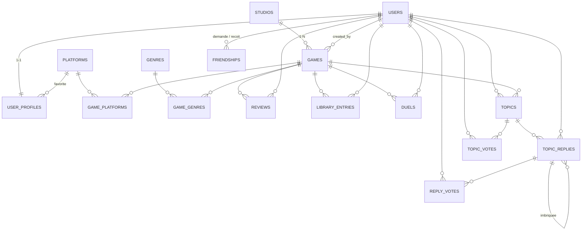

# Schéma relationnel

## Objectif

Ludorivya est le réseau de tes jeux vidéo : un catalogue de 328 vrais jeux, des avis, des bibliothèques personnelles, et un **mode versus** où les votes de la communauté font évoluer un classement Elo.

Le schéma complet est dans [`database/schema.sql`](../database/schema.sql) (16 tables), généré par le pipeline documenté dans [`database/dataset/`](../database/dataset/).

## Diagramme



```text
studios   (1) ---- (N) games                          <- 1-N demandee
users     (1) ---- (1) user_profiles                  <- 1-1 demandee (PK partagee)
games     (N) ---- (N) platforms  via game_platforms  <- N-N demandee (PK composite)
games     (N) ---- (N) genres     via game_genres     <- 2e N-N (filtrage)
users     (N) ---- (N) games      via library_entries <- N-N porteuse (statut, heures)
users     (N) ---- (N) games      via reviews         <- N-N porteuse (note, commentaire)
users     (N) ---- (N) games      via duels           <- N-N porteuse double (vainqueur + perdant)
users     (1) ---- (N) games      via created_by      <- qui a ajoute la fiche
platforms (1) ---- (N) user_profiles                  <- plateforme preferee (FK)
```

## Tables

### `studios`

Studios de développement.

- `id` clé primaire.
- `name` nom unique, `country`, `founded_year`, `website`.

### `games`

Les jeux du catalogue.

- `id` clé primaire.
- `studio_id` clé étrangère **NOT NULL** vers `studios` (`ON DELETE RESTRICT` : impossible de supprimer un studio qui a encore des jeux).
- `created_by` clé étrangère **NULL** vers `users` (`ON DELETE SET NULL`) : l'utilisateur qui a ajouté la fiche. Seul lui peut la modifier ou la supprimer.
- `title`, `description`, `release_date`, `age_rating` (CHECK 3–18), `cover_url` (facultatif).
- `metascore` (CHECK ≤ 100) : note presse approximative type Metacritic.
- `elo` (défaut 1000) : score du classement communautaire, recalculé par le serveur à chaque duel du mode versus.

**Relation 1-N** : un studio produit plusieurs jeux, chaque jeu a un studio principal.

### `users` et `user_profiles`

- `users` : identité et connexion (`username` et `email` uniques, `password_hash` bcrypt) + `xp` (gagnée via duels, avis et contributions ; le niveau est calculé en PHP : 1 niveau tous les 250 XP).
- `user_profiles` : présentation publique (`bio`, `favorite_platform_id`).

**Relation 1-1** : `user_profiles.user_id` est à la fois **clé primaire et clé étrangère** (PK partagée). C'est la forme la plus stricte du 1-1 : un utilisateur ne peut pas avoir deux profils.

`favorite_platform_id` est une clé étrangère vers `platforms` (`ON DELETE SET NULL`) : pas de texte libre, pas d'incohérence possible.

### `platforms` et `game_platforms`

**Relation N-N** : un jeu sort sur plusieurs plateformes, une plateforme accueille plusieurs jeux.

`game_platforms` a une **clé primaire composite** `(game_id, platform_id)` — aucun doublon possible — et porte l'attribut de liaison `release_region`.

### `genres` et `game_genres`

Deuxième relation N-N, clé primaire composite `(game_id, genre_id)`. Elle sert au **filtrage du catalogue par genre**.

### `library_entries`

La bibliothèque personnelle : relation **N-N porteuse d'attributs** entre `users` et `games` :

- `status` (souhaité, en cours, terminé, abandonné),
- `playtime_hours`,
- `added_at`.

La contrainte `UNIQUE (user_id, game_id)` garantit qu'un jeu n'apparaît qu'une fois par bibliothèque, et permet le `INSERT ... ON DUPLICATE KEY UPDATE` côté PHP (ajout ou mise à jour en une requête).

### `reviews`

Avis des joueurs : note `rating` (CHECK 0–20) + `comment`.

La contrainte `UNIQUE (game_id, user_id)` impose **un seul avis par joueur et par jeu** (modifiable via upsert).

### `duels`

Le mode versus : chaque ligne enregistre un vote « `winner_game_id` bat `loser_game_id` » émis par `user_id`.

- Double clé étrangère vers `games` : c'est une relation N-N porteuse *orientée* (le sens vainqueur/perdant porte l'information).
- `user_id` est en `ON DELETE SET NULL` : si un compte est supprimé, les statistiques des jeux (victoires/défaites) sont conservées.
- Le score `elo` des deux jeux est mis à jour **dans la même transaction** que l'insertion du duel (formule Elo, K = 32).
- Anti-triche : le serveur mémorise en session la paire qu'il a servie et n'accepte un vote que pour cette paire ; un délai minimal entre deux votes est imposé.

### `topics` et `topic_replies` (forum)

- `topics` : un sujet de discussion, créé par un utilisateur, **optionnellement rattaché à un jeu** (`game_id` NULL, `ON DELETE SET NULL` : le sujet survit si le jeu est supprimé).
- `topic_replies` : relation **1-N** (un sujet a plusieurs réponses), `ON DELETE CASCADE`. La colonne **`parent_id`** (clé étrangère vers `topic_replies` elle-même) permet les **réponses imbriquées** façon Reddit/Discord : c'est une relation **réflexive** 1-N.
- Suppression réservée à l'auteur (`WHERE user_id` côté PHP).

### `topic_votes` et `reply_votes` (like / dislike)

Deux relations **N-N porteuses** : un joueur vote (`value` = +1 ou -1, contrainte `CHECK`) sur un sujet ou une réponse.

- Clé primaire composite `(user_id, topic_id)` / `(user_id, reply_id)` : **un seul vote par joueur et par cible** (re-cliquer annule ou bascule le vote).
- Le score affiché est la somme `SUM(value)`.

### `friendships` (amis)

Relation **N-N réflexive** entre utilisateurs (table user ↔ user).

- `requester_id` (qui envoie la demande) + `addressee_id` (qui la reçoit), `status` ENUM(`pending`, `accepted`).
- Clé primaire composite + `CHECK (requester_id <> addressee_id)` (on ne s'ajoute pas soi-même).
- `ON DELETE CASCADE` des deux côtés : supprimer un compte supprime ses amitiés.

## Choix d'intégrité

| Cas | Politique | Pourquoi |
|---|---|---|
| Supprimer un studio qui a des jeux | `RESTRICT` | on ne perd jamais un jeu par accident |
| Supprimer un jeu | `CASCADE` | ses liaisons, avis et entrées de bibliothèque partent avec |
| Supprimer un utilisateur | `CASCADE` profil/avis/bibliothèque, `SET NULL` sur `games.created_by` | ses contributions au catalogue restent |
| Supprimer une plateforme | `SET NULL` sur la plateforme préférée | le profil survit |

## Remarques techniques

- Toutes les tables : `ENGINE=InnoDB`, `utf8mb4_unicode_ci`.
- Les contraintes `CHECK` sont appliquées à partir de MySQL 8.0.16 / MariaDB 10.4 ; les bornes sont de toute façon revalidées côté PHP.
- Le script est rejouable : `CREATE DATABASE IF NOT EXISTS` + `DROP TABLE IF EXISTS` dans l'ordre des dépendances.
